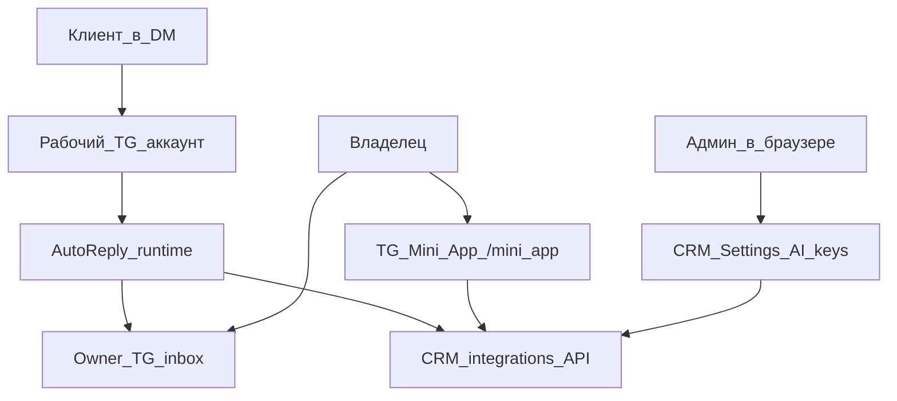

# AutoReply × CRM — Telegram Mini App (архитектура)

> **Актуальный обзор пульта — в [`README.md`](README.md) §4.**  
> Этот файл — детальный черновик архитектуры M0–M4 (2026-08-01).

**Дата:** 2026-08-01  
**Статус:** M0–M2 в коде · M3 drafts open · UI `/mini_app`  
**Хостинг:** CRM `https://crm.neosamptech.uz/mini_app`  
**Бот:** `@autorepllybot` открывает Mini App кнопкой / Menu Button

---

## 0. Зачем Mini App, а не «ещё кнопки в чате»

| Inline TG | Mini App |
|-----------|----------|
| 8–12 кликов на пресет | Один экран, табы |
| Неудобно править work_hours / ignore | Нормальные формы |
| Черновик ASSIST = стена текста | Список диалогов + Approve/Edit |
| Ключ CRM копипастой в `/crm_key` | «Подключить» / QR / статус связи |
| Нет картинки воронки | Канбан стадий диалогов |

**Принцип:** чат бота = операционный inbox (форварды, алерты, takeover).  
**Mini App = пульт управления.** CRM web = тяжёлая аналитика и ключи AI для админа за ноутбуком.

---

## 1. Роли поверхностей (кто что делает)



| Поверхность | Задачи |
|-------------|--------|
| **Mini App** | Режимы, пресеты, диалоги, ASSIST approve, статус Business/LLM/CRM, быстрый takeover |
| **Личка с ботом** | Inbox сообщений + STT + срочные алерты + deep-link «Открыть пульт» |
| **CRM /settings** | Пулы Groq/Gemini, генерация Autoreply API key, backup, сотрудники |
| **CRM /leads** | Карточка лида, Msg1 flags, notes брифа (как сейчас) |

Не дублировать полный CRM внутри Mini App. Mini App — **операторская панель продаж-бота**, не второй CRM.

---

## 2. URL и деплой

**Публичный URL (обязательно HTTPS):**  
`https://crm.neosamptech.uz/mini_app`

Варианты реализации (выбранный — A):

| | Вариант | Вердикт |
|---|---------|---------|
| **A** | Отдельный Vite entry / route в NSTLeadGen frontend, layout без сайдбара CRM, mobile-first | ✅ один деплой, один домен, TLS уже есть |
| B | Отдельный сервис на поддомене | лишний ops |
| C | Статика с VPS бота | два TLS, хуже |

**BotFather:** Menu Button / Web App URL = этот путь.  
**Кнопка в сообщениях:** `web_app` keyboard → тот же URL.

SPA: роут `/mini_app/*` не должен требовать CRM login cookie — только Telegram `initData` (см. §3).  
Админский CRM `/settings` остаётся за JWT.

---

## 3. Авторизация Mini App (критично)

1. Клиент Telegram передаёт `window.Telegram.WebApp.initData`.  
2. Backend `POST /api/integrations/autoreply/miniapp/auth`:
   - HMAC-SHA-256 проверка `initData` с `BOT_TOKEN` (или shared secret от бота → CRM).  
   - Извлечь `user.id` (Telegram user id).  
   - Allowlist: `owner_telegram_ids` + роли CRM (admin/manager), иначе 403.  
3. Выдать короткоживущий **Mini App JWT** (15–60 мин) scoped `autoreply:operator`.  
4. Дальше Mini App ходит в `/api/integrations/autoreply/miniapp/*` с этим JWT.

**Связка с CRM-ключом бота:** runtime бота по-прежнему использует service `X-API-Key` для server-to-server.  
Mini App **не** светит Autoreply API key в браузере — только operator JWT.

Где хранить `BOT_TOKEN` для verify initData:
- в CRM `.env` `TELEGRAM_BOT_TOKEN` (только hash-verify, бот не обязан жить на том же хосте), **или**
- бот экспонирует внутренний `POST /internal/verify-init-data` по mTLS/shared secret — сложнее, не v1 Mini App.

**Выбор v1 Mini App:** `TELEGRAM_BOT_TOKEN` в CRM env (как у многих TG+backend связок).

---

## 4. API для Mini App (CRM)

Префикс: `/api/integrations/autoreply/miniapp`

| Метод | Назначение |
|-------|------------|
| `POST /auth` | initData → JWT |
| `GET /me` | кто я, права |
| `GET /status` | Business connection, LLM pools size (без raw keys), CRM sync, uptime бота |
| `GET /settings` | политики §11 TZ |
| `PATCH /settings` | смена reply_mode, night, identity, depth, nurture… |
| `POST /settings/presets/{name}` | Боевой / Осторожный / Секретарь / Ночной |
| `GET /dialogs?state=` | список диалогов (из бота через sync или read-model в CRM) |
| `GET /dialogs/{chat_id}` | brief, state, last messages meta |
| `POST /dialogs/{id}/takeover` | пауза бота |
| `POST /dialogs/{id}/resume` | бот снова |
| `GET /drafts` | ASSIST черновики |
| `POST /drafts/{id}/approve` | отправить клиенту через бота |
| `POST /drafts/{id}/discard` | |
| `GET /stats/week` | то же, что weekly digest |

### Кто владеет state диалогов?

**Проблема:** state сейчас в SQLite бота. Mini App на CRM.

| Модель | Плюсы | Минусы |
|--------|-------|--------|
| **B1. CRM = source of truth** для dialogs/settings | Mini App и лиды в одном месте | бот всегда ходит в CRM; offline сложнее |
| **B2. Бот = SoT, CRM проксирует** | меньше миграции | CRM→бот webhook/RPC нужен |
| **B3. Dual-write** | — | рассинхрон, ад |

**Выбор:** **B1 поэтапно.**

1. Сейчас: бот пишет события в CRM (уже есть events/notes/msg1).  
2. Mini App v1: settings + status через CRM; settings бот **pull** каждые N сек / webhook.  
3. Mini App v1.1: таблица `autoreply_dialogs` в CRM (chat_id, state, brief_json, takeover…) — бот upsert на каждом ходе; Mini App читает отсюда.  
4. ASSIST drafts: таблица `autoreply_drafts` в CRM; approve → CRM дергает бота `POST /internal/send` с `business_connection_id`.

Для вызова бота из CRM нужен **callback URL бота** (ngrok/VPS) + shared secret — поле в CRM Settings «Bot runtime URL».

---

## 5. Экраны Mini App (IA)

Mobile-first, тёмная/светлая как Telegram theme (`themeParams`).

1. **Home / Status**  
   Режим · ночь · Business OK · LLM Groq/Gemini count · кнопка пресетов.

2. **Режимы**  
   Все политики §11.4 + пресеты одним тапом.  
   (Закрывает дыры BACKLOG B: work_hours, ignore, presets.)

3. **Диалоги**  
   Фильтр: активные / ждут вилку / бриф / ТЗ / takeover / эскалации.  
   Карточка: brief, ссылка «открыть лид в CRM» если `crm_lead_id`.

4. **Черновики (ASSIST)**  
   Текст → Approve / Править / Отклонить.

5. **Связь**  
   Статус API, last sync, «Переподключить» (не сырой ключ — для service key остаётся CRM Settings на ПК).

Глубина визуала: как Telegram / простой ops UI. Не клонировать весь CRM.

---

## 6. Поток «владелец открыл пульт»

```
Owner нажимает Menu / «Пульт»
  → Telegram открывает https://crm.../mini_app
  → JS: Telegram.WebApp.ready(); expand()
  → POST /miniapp/auth { initData }
  → JWT в memory
  → GET /status + /settings
  → UI
```

Алерт в inbox: «Нужен человек» + кнопка WebApp `?dialog={chat_id}` → deep link на карточку.

---

## 7. Что упрощается в боте

После Mini App **урезать** inline `/settings` до:
- ссылка «Открыть пульт» (WebApp)
- pause / takeover на карточке inbox  
- `/status` одной строкой

Не пилить дальше циклы кнопок для work_hours — это антипаттерн при наличии Mini App.

---

## 8. Безопасность

- HTTPS only, initData TTL check (`auth_date`).  
- Allowlist telegram user ids.  
- Mini App JWT ≠ Autoreply service key.  
- Approve draft — только allowlisted operator.  
- Rate limit miniapp auth.  
- CSP: frame только Telegram.  
- Не логировать initData целиком.

---

## 9. Этапы внедрения

### M0 — фундамент (после деплоя текущего CRM API)
- Route `/mini_app` shell (hello + theme + auth stub)
- `POST /miniapp/auth` + allowlist
- Menu Button в BotFather

### M1 — пульт настроек (макс ROI)
- GET/PATCH settings + пресеты  
- Бот pull settings из CRM (источник правды)  
- Закрывает BACKLOG B почти целиком

### M2 — диалоги + takeover
- `autoreply_dialogs` в CRM, бот upsert  
- Список/карточка в Mini App

### M3 — ASSIST approve
- drafts table + approve → bot send  
- Заменяет «черновик стеной текста»

### M4 — polish
- Deep links из алертов, недельная статистика, multi-operator

---

## 10. Риски и решения

| Риск | Решение |
|------|---------|
| Mini App не открывается без HTTPS | только prod CRM domain |
| Бот и CRM на разных машинах | Bot Runtime URL + secret |
| State разъедется | B1: CRM SoT для settings/dialogs |
| Сложный UI в TG WebView | простые экраны, без тяжёлого CRM shell |
| Два источника настроек | после M1 — только CRM; локальный SQLite бота = cache |

---

## 11. Решение по направлению (зафиксировано)

1. **Да, Mini App** — основной UX управления автоответчиком.  
2. **Хостинг в CRM** на `/mini_app`.  
3. **Auth** через Telegram initData → operator JWT.  
4. **Settings SoT → CRM**; бот кэширует.  
5. **Чат бота** остаётся inbox + алерты, не админкой.  
6. Inline settings cycles — **заморозить развитие**, заменить Mini App M1.

Следующий шаг кода (когда скажешь «делай Mini App»): M0 shell + auth в NSTLeadGen + Menu Button.
